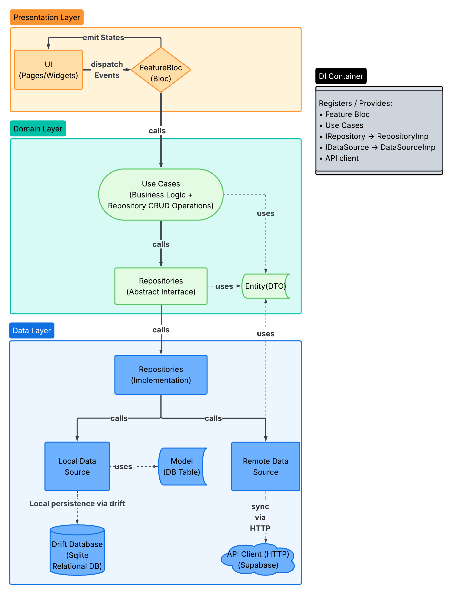
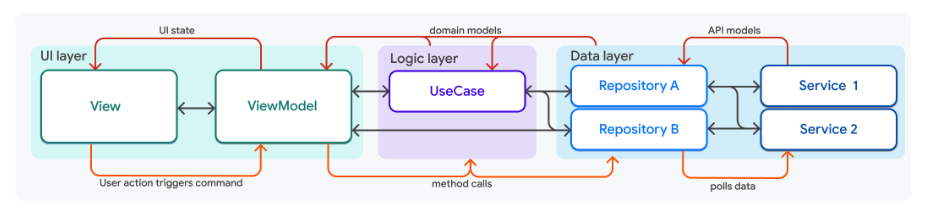
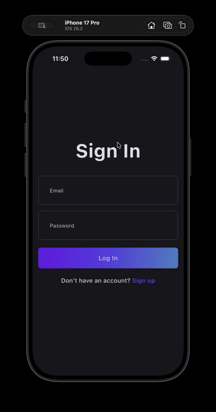
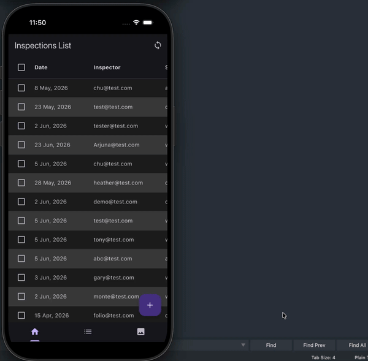
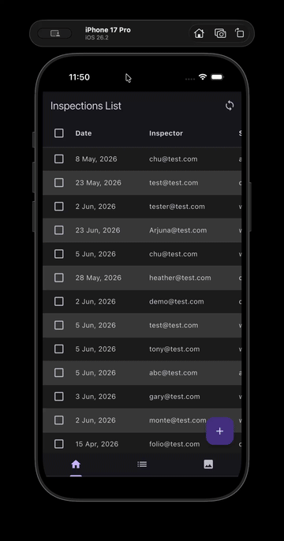
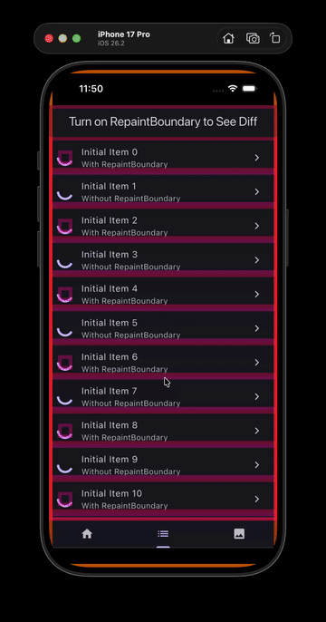

# OfflineFirstInspection
This is flutter portfolio project designed for offline first mobile app that lets users create inspection forms in offline environment, and sync with server later when internet is available. It also contains two independent tab pages for demoing app performance & optimization for large image list view. They are not related to the inspection form feature at all. 

Inspection Feature:
User must first signup and signin in order to retrieve list of existing inspections in the main table view tab page. User can create new, edit, or view existing inspection form use the top app bar buttons and the floating add button. Tapping on the sync button to sync offline data to cloud. 

(Note: My Supabase app secret is omitted therefore you won't be able to signup or signin if you build my project, since this is my personal profolio project. Demo videos are provided to show case the app features) 

## Feature first Project Structure
I use feature based project structure which is flutter recommended modern standard. It is more organized than traditional layer structure.
```
/features
      /auth
            /data
            /domain
            /presentation (bloc)

      /inspection_form
            /data
            /domain
            /presentation (bloc)
```

## Clean Architecture
I use Clean Architecture design pattern that divides my application into independent, modular layers (Data | Domain | Presentation) to enforce strict separation of concerns. I implemented Repository Pattern to provide a layer of abstraction between my application's core business logic and its data storage layer.

Note: UseCase abstraction is one of the most debated topic among developers. I do agree that it is over engineering if your app only does simple CRUD operations. In this case, you can simply use IRepository interface inside of Bloc instead of UseCase. But if you are doing CRUD + additional business logic e.g data validation, user verification, then it is better to move that logic into UseCase to keep your Bloc clean.



You can find more definition on flutter's architecture guide documnet on [UseCase here](https://docs.flutter.dev/app-architecture/guide)



## Flutter State Management and Other Essential Package Choices:

### State Management:

[Bloc](https://pub.dev/packages/flutter_bloc) is used for flutter state management. It enables unidirectional workflow and enforce clean architecture design.
Bloc makes unit testing Bloc/Cubit super easy !
```
   User Action 
-> Bloc Event/or Cubit 
-> Bloc Event handler 
-> execute Use Case (Data source CRUD operations + Business logic) 
-> Bloc emit new State 
-> UI BlocBuilder listen to and refresh based on new State.
```
[Riverpod](https://pub.dev/packages/flutter_riverpod) Branch:
I also created a 'Riverpod' branch that replaced Bloc with Riverpod package for state management. Note: there is a compatibility issue between drift and riverpod_generator, therefore, I have to avoid using @riverpoad macro and write provider manually. 

### Dependency Injection (Service Locator):

[get_it](https://pub.dev/packages/get_it) is chosen for its easy setup and support for both lazy and factory dependency register.
```dart
getIt.registerLazySingleton<SupabaseClient>(() => supabase.client);
getIt.registerFactory<IAuthRemoteDataSource>(
      () => AuthRemoteDataSourceImpl(getIt<SupabaseClient>()), )
```

### Offline Database:

[drift](https://pub.dev/packages/drift) is great for structured and relational database. 
It supports complex local db schema migration. 
It also make testing local schema migrations easy.

### JSON Serialization:

[json_serializable](https://pub.dev/packages/json_serializable) This package dynamically generate .g.dart code for toJson() and fromJson() methods.

you can either manually run:
```
dart run build_runner build
```
or let the build_runner watch in background automatically detects changes and generates .g.dart code:
```
dart run build_runner watch --delete-conflicting-outputs
```
In your Entity or DTO class, you simply have these two method declaration, their implementation is generated in .g.dart file:

```dart
factory InspectionFormDto.fromJson(Map<String, dynamic> json) => _$InspectionFormDtoFromJson(json);
Map<String, dynamic> toJson() => _$InspectionFormDtoToJson(this);
```

### Authentication & Backend (Supabase):

I use supabase for user authentication and relational database since I want structured data. Alternatively, Firebase is another great choice if you want nosql unstructured data.

## Tests:

This project provides examples of various type of tests that covers:
 - Unit Tests
   - Bloc Tests
   - Drift DB Migration Tests
- Widget Tests
- Integration Tests
 
## Demo:
App demo: User Login -> Initialial Data Fetech -> CRUD offline inspection form -> Sync with Server 



App demo: Responsive Tab View Layout Handles both Portrait and Lanscape screen size 



App demo: Infinite Fast Scrolling Image List View



App Performance demo: Use RepaintBoundary to isolate animation widget inside list cell to reduce unnecessary list cell repaint
Note: loading animation widget isolated with RepaintBoundary does not cause its parent list cell to repaint compare to the ones without RepaintBoundary




I would like to give a special shout-out to the [@RivaanRanawat](https://www.youtube.com/@RivaanRanawat) YouTube channel. I utilized some of his tutorial's UI theme classes to streamline the app's cosmetics, allowing me to focus heavily on core functionality.

My project aligns closely with his architectural choices, and I followed his Clean Architecture setup. The main divergence is in the local data layer: while his project uses Hive NoSQL, I implemented a relational database using Drift. I highly recommend checking out his channel for excellent development content.
